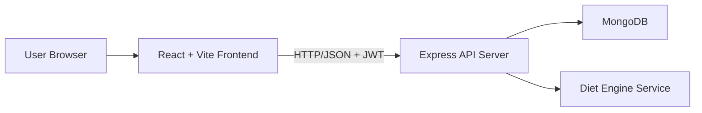
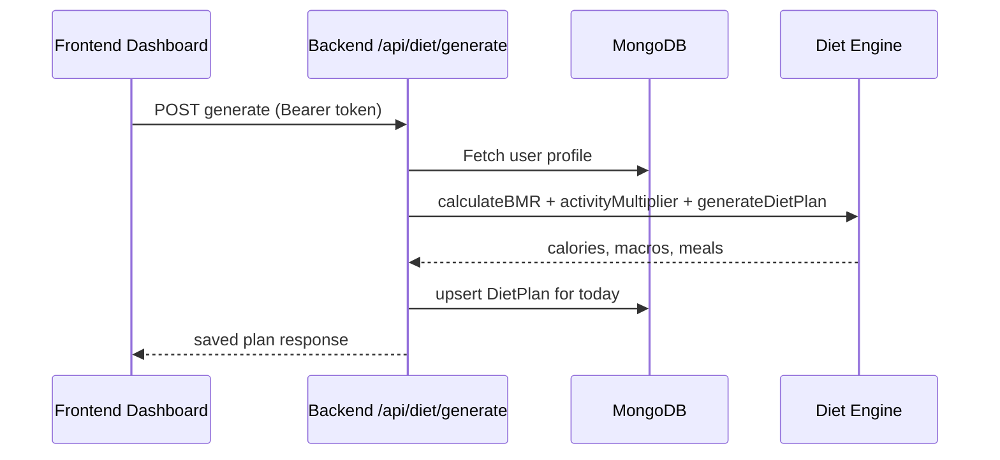

# NUTRIMIND AI (MERN STACK)
## Final Year Project Report (Submission-Ready)

---

## 0. Front Matter

### 0.1 Title Page (Use College Format)

**Project Title:** NutriMind AI - Personalized Nutrition Planning and Progress Tracking Web Application  
**Project Type:** Final Year Major Project  
**Technology Stack:** MongoDB, Express.js, React (Vite), Node.js, Tailwind CSS  
**Submitted by:** `<Student Name>`  
**Enrollment No.:** `<Enrollment Number>`  
**Branch:** `<Branch Name>`  
**College:** `<College Name>`  
**University:** `<University Name>`  
**Session:** `<Academic Session>`  
**Under Guidance of:** `<Guide Name>`

### 0.2 Certificate (Template)

This is to certify that the project report titled **"NutriMind AI"** submitted by `<Student Name>` in partial fulfillment of the requirements for the award of `<Degree Name>` is a bonafide work carried out under my supervision during `<Year>`.

**Guide Signature:** ____________  
**HOD Signature:** ____________  
**Department Seal**

### 0.3 Declaration (Template)

I hereby declare that this project report entitled **"NutriMind AI"** is my original work and has not been submitted elsewhere for any degree or diploma.

**Student Signature:** ____________  
**Date:** ____________

### 0.4 Acknowledgement

I express my sincere gratitude to my project guide, faculty members, and my department for continuous support, mentorship, and valuable feedback during this project. I also thank my friends and family for encouragement throughout development and testing.

### 0.5 Abstract

NutriMind AI is a full-stack web application developed to provide practical, personalized daily diet plans for Indian users. The system captures user profile data (age, gender, height, weight, activity level, goal, diet preference, and allergies), computes calorie requirements using BMR and activity multipliers, generates macro targets, and produces a day-level meal plan with breakfast, lunch, snacks, and dinner.

The project is implemented using the MERN stack. The frontend is built in React with Vite and Tailwind CSS; the backend uses Express with JWT-based authentication and MongoDB for persistent storage. The platform also tracks meal compliance and body-weight progression over time with chart visualization.

During iterative development, multiple practical issues were identified and resolved, including backend route crashes, port conflicts, profile field mismatches, null state rendering errors, API base URL inconsistency, and daily meal-log persistence defects. This report documents complete SDLC phases, architecture, implementation details, testing strategy, bug-fix history, deployment readiness, and future enhancement plan.

### 0.6 Keywords

MERN, Diet Planning, BMR, Calorie Tracking, Meal Compliance, JWT Authentication, MongoDB, React Dashboard, Final Year Project.

---

## 1. Table of Contents (Recommended)

1. Introduction  
2. Literature Survey  
3. Requirement Analysis  
4. Feasibility and Planning  
5. System Design  
6. Implementation  
7. Testing and Validation  
8. Bug Resolution and Stabilization Log  
9. Results and Discussion  
10. Deployment and Operations  
11. Conclusion and Future Scope  
12. References  
13. Appendices

---

## 2. List of Figures (Placeholders)

1. System Architecture Diagram  
2. User Flow Diagram  
3. Database Schema Diagram  
4. Authentication Flow  
5. Diet Generation Flow  
6. Dashboard Screen  
7. Profile Setup Screen  
8. Weight Progress Screen  
9. API Route Map  
10. Deployment Architecture

---

## 3. List of Tables (Placeholders)

1. Functional Requirements  
2. Non-Functional Requirements  
3. Hardware and Software Requirements  
4. API Endpoint Matrix  
5. Test Case Matrix  
6. Bug Tracker Table  
7. Risk Register  
8. Effort and Timeline Plan

---

## 4. Chapter 1: Introduction

### 4.1 Background

Nutrition-focused applications are increasingly important due to sedentary lifestyles, irregular eating habits, and limited access to personalized guidance. Most users need simple and realistic plans aligned with local dietary habits and budget. The NutriMind AI project addresses this by generating practical meal plans from basic health profile inputs.

### 4.2 Problem Statement

General diet plans available online are often:
- Non-personalized
- Hard to follow in Indian household contexts
- Lacking meal-level tracking
- Not integrated with weight progress monitoring

Users need a single platform that can:
- Understand personal details
- Calculate required calories and macro distribution
- Offer daily meal plans
- Track compliance and progress over time

### 4.3 Project Objectives

1. Build a secure full-stack diet planning platform using MERN.  
2. Collect user profile and health preferences after registration.  
3. Compute BMR and estimate TDEE to derive daily calorie goals.  
4. Generate meal plans split into breakfast, lunch, snacks, and dinner.  
5. Track whether planned meals are consumed or skipped.  
6. Record body weight and visualize progress via charts.  
7. Provide production-stable code with robust error handling.

### 4.4 Scope

**In Scope**
- Authentication (register/login)
- Profile management
- Rule-based diet generation
- Daily meal tracking
- Weight history visualization
- Diet history retrieval

**Out of Scope (Current Version)**
- Live dietitian consultation
- Real-time wearable integrations
- Multilingual NLP assistant
- Payment and subscription modules

### 4.5 Project Significance

The project demonstrates practical full-stack engineering for healthcare-adjacent software with domain logic, stateful tracking, backend APIs, and deployment readiness, making it suitable for both academic evaluation and portfolio use.

---

## 5. Chapter 2: Literature Survey

### 5.1 Existing Solutions

Popular platforms like MyFitnessPal and Healthify-style products focus heavily on global food databases and extensive logging flows. However, student-level academic projects can improve usability in local context by narrowing scope to achievable features and reliable workflows.

### 5.2 Observed Gaps

- Complex onboarding in many apps
- Region-specific meal relevance often limited
- Expensive premium features for advanced tracking
- Poor transparency in recommendation logic

### 5.3 Proposed System Positioning

NutriMind AI focuses on:
- Simplicity of onboarding
- Indian meal relevance
- Explainable calculations (BMR/TDEE/macros)
- Minimal friction user flow

### 5.4 Research Inputs Used

- Mifflin-St Jeor BMR formula
- Activity multiplier mapping
- Macro split principle (protein/carbs/fats)
- Incremental compliance tracking approach

---

## 6. Chapter 3: Requirement Analysis

### 6.1 Stakeholders

- End User (student/professional fitness learner)
- Project Developer
- Academic Guide and Evaluation Committee

### 6.2 Functional Requirements

| ID | Requirement |
|---|---|
| FR1 | User can register with name, email, and password |
| FR2 | User can login and receive JWT token |
| FR3 | User can save profile data (age, gender, height, weight, etc.) |
| FR4 | System computes calorie target from profile |
| FR5 | System generates a daily diet plan |
| FR6 | User can fetch current plan |
| FR7 | User can view historical plans |
| FR8 | User can mark meal as eaten/skipped |
| FR9 | User can log daily weight |
| FR10 | User can view weight history graph |
| FR11 | Protected APIs require valid token |
| FR12 | Health endpoint available for uptime checks |

### 6.3 Non-Functional Requirements

| ID | Requirement |
|---|---|
| NFR1 | Responsive UI for desktop/laptop/mobile |
| NFR2 | Fast API response for key operations |
| NFR3 | Secure token verification |
| NFR4 | Data persistence and consistency |
| NFR5 | Graceful error handling on invalid input |
| NFR6 | Easy local setup for demo and viva |

### 6.4 Hardware and Software Requirements

**Hardware**
- 4GB+ RAM
- Dual-core CPU or above
- 10GB free disk space

**Software**
- Node.js (v18+ recommended)
- npm
- MongoDB (local or Atlas)
- Browser (Chrome/Edge/Firefox)
- VS Code (optional)

### 6.5 User Roles

Single role in current version: authenticated end-user with self-data access.

---

## 7. Chapter 4: Feasibility and Planning

### 7.1 Technical Feasibility

High feasibility due:
- Mature JavaScript ecosystem
- Ready libraries for auth, API, charts, and DB
- Clear separation between frontend and backend services

### 7.2 Economic Feasibility

Development completed on zero/minimal cost using open-source technologies.

### 7.3 Operational Feasibility

User flow is straightforward and can be demonstrated in college lab setup.

### 7.4 Schedule Feasibility (One-Week Stabilization Sprint)

| Day | Task |
|---|---|
| Day 1 | Requirement confirmation and bug triage |
| Day 2 | Backend startup and route stabilization |
| Day 3 | Frontend blank-page and flow fixes |
| Day 4 | Profile-diet integration and field mapping |
| Day 5 | Logging modules and progress chart validation |
| Day 6 | Build/lint/runbook verification |
| Day 7 | Report documentation and final packaging |

### 7.5 Risk Management Summary

| Risk | Impact | Mitigation |
|---|---|---|
| Port already in use | Backend won’t start | Kill process or change PORT |
| MongoDB service down | API startup failure | Ensure mongod service active |
| Field mismatch FE/BE | Data not saved/loaded correctly | Standardized schema mapping |
| Missing middleware | API crashes | Added required JSON parser |
| Null response rendering | Blank dashboard page | Guarded rendering with checks |

---

## 8. Chapter 5: System Design

### 8.1 High-Level Architecture



### 8.2 Module Decomposition

**Frontend Modules**
- Authentication pages (Welcome/Login/Register)
- Profile setup page
- Dashboard (plan + compliance)
- Weight progress page
- API service layer with token interceptor

**Backend Modules**
- Route layer
- Controller layer
- Middleware (auth)
- Model layer (Mongoose)
- Utility layer (DB, JWT, BMR functions)
- Service layer (diet generation logic)

### 8.3 Data Flow (Diet Generation)



### 8.4 Database Design

#### 8.4.1 User Collection

- name
- email (unique)
- password (hashed)
- age, gender, height, weight
- activityLevel
- goal
- dietPreference
- allergies[]

#### 8.4.2 DietPlan Collection

- user (ObjectId)
- date (YYYY-MM-DD)
- totalCalories
- macros { protein, carbs, fats }
- meals (object)
- timestamps

#### 8.4.3 MealLog Collection

- user (ObjectId)
- date (YYYY-MM-DD)
- mealType (breakfast/lunch/snacks/dinner)
- eaten (Boolean)

#### 8.4.4 ProgressLog Collection

- user (ObjectId)
- date (YYYY-MM-DD)
- weight (Number)

### 8.5 API Design Matrix

| Method | Endpoint | Purpose | Auth |
|---|---|---|---|
| POST | /api/auth/register | Create account | No |
| POST | /api/auth/login | Login and token | No |
| GET | /api/users/me | Fetch profile | Yes |
| PUT | /api/users/me | Update profile | Yes |
| POST | /api/diet/generate | Generate daily plan | Yes |
| GET | /api/diet/current | Get latest plan | Yes |
| GET | /api/diet/history | Fetch historical plans | Yes |
| GET | /api/meals/today | Fetch meal statuses | Yes |
| POST | /api/meals/toggle | Mark meal eaten/skipped | Yes |
| POST | /api/progress/weight | Add/update daily weight | Yes |
| GET | /api/progress | Get all weight logs | Yes |
| GET | /api/health | Service health check | No |

### 8.6 Security Design

- JWT-based request authentication
- Protected route middleware checks token validity
- Password hashing using bcrypt
- CORS configured for allowed origins
- Backend avoids exposing sensitive credentials in client

---

## 9. Chapter 6: Implementation

### 9.1 Technology Stack

- **Frontend:** React 19, Vite, Tailwind CSS, Axios, React Router, Chart.js
- **Backend:** Node.js, Express, JWT, bcryptjs, Mongoose, CORS, dotenv
- **Database:** MongoDB

### 9.2 Frontend Implementation Highlights

1. **Welcome Page** with product branding and feature cards.  
2. **Login Page** with API integration and token storage.  
3. **Register Page** for account creation.  
4. **Profile Page** to collect user-specific requirement data.  
5. **Dashboard** for calorie targets, meal plan cards, macro ring indicators, compliance bar.  
6. **Weight Progress Page** with line-chart visualization.

### 9.3 Backend Implementation Highlights

1. Entry point (`server.js`) loads env, connects DB, then starts server.  
2. App bootstrap (`src/app.js`) mounts middleware and route modules.  
3. Controllers encapsulate business logic by feature.  
4. Models define MongoDB schema with timestamps.  
5. Utility modules handle BMR and token generation.

### 9.4 Diet Logic Implemented

- BMR computed from profile data
- Activity multiplier selected from sedentary/moderate/active
- TDEE approximated from BMR × multiplier
- Macros allocated roughly:
  - Protein: 30%
  - Carbs: 50%
  - Fats: 20%
- Diet meals generated from practical meal templates and allergy filtering

### 9.5 Authentication and Authorization

- Token generated at login (`jsonwebtoken`)
- Frontend stores token in localStorage
- Axios interceptor automatically attaches Bearer token
- Protected endpoints verify token and expose `req.user`

### 9.6 Deployment Readiness

- Environment-based API URL support in frontend
- Backend configurable by env vars (`PORT`, `MONGO_URI`, `JWT_SECRET`)
- Build verified for production frontend output (`dist/`)

---

## 10. Chapter 7: Testing and Validation

### 10.1 Testing Strategy

- Manual API verification (endpoint-by-endpoint)
- UI flow validation (registration to dashboard)
- Regression checks after each fix
- Build/lint checks for frontend stability

### 10.2 Test Environment

- Local machine (macOS)
- Node + npm
- MongoDB local instance
- Browser-based UI tests

### 10.3 Test Case Matrix

| TC ID | Test Scenario | Input | Expected Result | Status |
|---|---|---|---|---|
| TC01 | Register new user | valid payload | 201 created | Pass |
| TC02 | Register duplicate user | same email | error message | Pass |
| TC03 | Login valid user | correct credentials | token returned | Pass |
| TC04 | Login invalid user | wrong password | invalid credentials | Pass |
| TC05 | Access protected API without token | none | 401 unauthorized | Pass |
| TC06 | Save profile fields | valid body | profile updated | Pass |
| TC07 | Fetch profile | token | correct fields | Pass |
| TC08 | Generate diet | profile present | plan returned/saved | Pass |
| TC09 | Fetch current diet | token | latest plan | Pass |
| TC10 | Fetch diet history | token | array response | Pass |
| TC11 | Toggle meal eaten | meal + bool | status saved | Pass |
| TC12 | Fetch today meals | token | today logs | Pass |
| TC13 | Save weight | positive number | weight persisted | Pass |
| TC14 | Save invalid weight | empty/negative | 400 validation | Pass |
| TC15 | Fetch progress list | token | sorted list | Pass |
| TC16 | Dashboard without diet | first login | no crash + generate button | Pass |
| TC17 | API base URL fallback | no env value | localhost API used | Pass |
| TC18 | Frontend lint | n/a | no lint errors | Pass |
| TC19 | Frontend production build | n/a | build success | Pass |
| TC20 | Health endpoint | GET /api/health | `{ok:true}` | Pass |

### 10.4 Validation Evidence to Attach in Report PDF

- Terminal screenshot of backend startup
- Screenshot of frontend build success
- Login success screenshot
- Profile save screenshot
- Dashboard plan generation screenshot
- Weight graph screenshot
- API response screenshots from Postman/Thunder Client

---

## 11. Chapter 8: Bug Resolution and Stabilization Log

This chapter is critical for viva and project evaluation because it demonstrates debugging and engineering maturity.

### 11.1 Bug Tracker Summary

| Bug ID | Symptom | Root Cause | Resolution |
|---|---|---|---|
| B01 | `ReferenceError: authRoutes is not defined` | Broken rollback state in server entry routing | Restored clean server bootstrap with `app` import and proper route mounting in `src/app.js` |
| B02 | Backend crash on auth body access | JSON parser middleware missing | Added `app.use(express.json())` |
| B03 | Frontend blank dashboard | Null diet object accessed before load | Added guard rendering and safe optional checks |
| B04 | Profile values not persisting correctly | Field mismatch (`activity` vs `activityLevel`, `dietType` vs `dietPreference`) | Standardized frontend+backend field names |
| B05 | Wrong API target from frontend | Base URL misconfiguration | Restored `VITE_API_BASE_URL || http://localhost:5001/api` fallback |
| B06 | Port already in use (`EADDRINUSE`) | Old process occupying backend port | Added runbook to kill old process and restart cleanly |
| B07 | MongoDB connection refused | Local MongoDB service not active | Added startup checklist and service verification |
| B08 | Meal status disappeared on refresh | Meal logs upserted without date; daily query filtered by date | Fixed `toggleMeal` upsert to include `date` and daily key |
| B09 | Profile fetch returned incomplete fields | Backend select queried wrong schema properties | Corrected select fields to `activityLevel`, `dietPreference`, `allergies` |
| B10 | Sensitive profile response risk | Updated profile response could include password | Added `.select("-password")` in update response |
| B11 | Weak error handling in progress APIs | Missing try/catch and input validation | Added validation and robust error responses |
| B12 | Inconsistent auth middleware usage | Two middleware styles causing confusion | Stabilized decoding expectations and route-level usage |

### 11.2 Detailed Debug Notes (For Viva)

#### B01: Undefined Route Reference
- **Observed:** Backend immediately crashed at startup.
- **Diagnosis:** Server file referenced undeclared `authRoutes`.
- **Fix:** Replaced with centralized `app` mounting pattern.
- **Learning:** Keep startup file minimal; mount routes only in app bootstrap.

#### B03: White/Blank Dashboard Screen
- **Observed:** UI rendered blank after login in some states.
- **Diagnosis:** Rendering logic expected `diet` object before generation.
- **Fix:** Added conditional fallback screen with "Generate Diet Plan" CTA.
- **Learning:** Always null-guard async state in React.

#### B08: Meal Tracking Inconsistency
- **Observed:** Meal status appeared changed but reset after reload.
- **Diagnosis:** Upsert key did not include date, and created records lacked today date.
- **Fix:** Included `date` in query and update payload for daily persistence.
- **Learning:** Time-series data must always include proper partition key (date/day).

### 11.3 Preventive Actions Adopted

- Added safer default values in diet generation controller
- Added health endpoint for quick deployment diagnostics
- Added structured startup commands for clean local runs
- Applied input validation in critical write endpoints

---

## 12. Chapter 9: Results and Discussion

### 12.1 Functional Outcome

The application now supports complete end-to-end user flow:
1. User registration and login  
2. Profile onboarding with personal health requirements  
3. Diet generation based on user profile  
4. Meal compliance tracking  
5. Weight progress trend visualization

### 12.2 Usability Outcome

- UI is simple and mobile-friendly
- Key actions are available in 1-2 clicks
- User can see direct impact of profile data on generated plan

### 12.3 Reliability Outcome

- Frontend lint and production build pass
- Protected APIs enforce authentication
- Known crash paths have been patched

### 12.4 Academic Outcome

The project demonstrates practical competencies in:
- Full-stack engineering
- REST API design
- MongoDB schema modeling
- Debugging and regression management
- Documentation and reporting discipline

---

## 13. Chapter 10: Deployment and Operations

### 13.1 Environment Variables

Backend `.env` (example):

```env
PORT=5001
MONGO_URI=mongodb://127.0.0.1:27017/ai_diet_planner
JWT_SECRET=replace_with_secure_secret
```

Frontend `.env` (example):

```env
VITE_API_BASE_URL=http://localhost:5001/api
```

### 13.2 Local Runbook

1. Start MongoDB service.  
2. Backend:
   - `cd /Users/vinaykumargautam/Desktop/AI_Diet_Planner/backend`
   - `npm run dev`
3. Frontend:
   - `cd /Users/vinaykumargautam/Desktop/AI_Diet_Planner/frontend`
   - `npm run dev`
4. Open browser: `http://localhost:5173`

### 13.3 Port Conflict Recovery

If backend port is busy:
- Check process: `lsof -i :5001`
- Kill process: `kill -9 <PID>`
- Restart backend

### 13.4 MongoDB Error Recovery

If `ECONNREFUSED 127.0.0.1:27017`:
- Start MongoDB service
- Validate local URI
- Retry backend startup

---

## 14. Chapter 11: Conclusion and Future Scope

### 14.1 Conclusion

NutriMind AI has been successfully implemented as a stable MERN application with personalized daily planning, profile-based calculations, compliance logging, and progress visualization. The project matured through iterative debugging and now runs in a reliable condition suitable for final-year demonstration and evaluation.

### 14.2 Future Scope

1. Add food database with search and nutrient breakdown.  
2. Add budget-aware meal optimization (low/medium/high).  
3. Integrate LLM-powered chatbot for nutrition Q&A.  
4. Implement admin panel for content moderation.  
5. Add PDF export for weekly diet and progress summaries.  
6. Add reminders/notifications and streak features.  
7. Strengthen test coverage with Jest + Supertest + Cypress.

---

## 15. References

1. Node.js Official Documentation - https://nodejs.org/docs  
2. Express.js Guide - https://expressjs.com/  
3. React Documentation - https://react.dev/  
4. Vite Documentation - https://vitejs.dev/  
5. MongoDB Documentation - https://www.mongodb.com/docs/  
6. Mongoose Documentation - https://mongoosejs.com/docs/  
7. JWT Introduction - https://jwt.io/introduction  
8. bcryptjs npm package docs  
9. Chart.js Documentation - https://www.chartjs.org/docs/latest/  
10. Tailwind CSS Docs - https://tailwindcss.com/docs  
11. Mifflin-St Jeor Equation references (nutrition science sources)  
12. REST API best practice resources  
13. OWASP Top 10 (web security awareness)  
14. RFC 7519 JSON Web Token  
15. College project report formatting guideline document

---

## 16. Appendix A: API Documentation (Detailed)

### A1. Register

`POST /api/auth/register`

Request:
```json
{
  "name": "Vinay",
  "email": "vinay@example.com",
  "password": "123456"
}
```

Response:
```json
{
  "message": "Registered successfully"
}
```

### A2. Login

`POST /api/auth/login`

Request:
```json
{
  "email": "vinay@example.com",
  "password": "123456"
}
```

Response:
```json
{
  "token": "<jwt>",
  "user": {
    "id": "userId",
    "name": "Vinay",
    "email": "vinay@example.com"
  }
}
```

### A3. Update Profile

`PUT /api/users/me` (Bearer token required)

Request:
```json
{
  "age": 22,
  "gender": "male",
  "height": 172,
  "weight": 70,
  "activityLevel": "moderate",
  "goal": "maintenance",
  "dietPreference": "vegetarian",
  "allergies": ["milk"]
}
```

### A4. Generate Diet

`POST /api/diet/generate` (Bearer token required)

Response (sample):
```json
{
  "_id": "planId",
  "user": "userId",
  "date": "2026-04-20",
  "totalCalories": 2200,
  "macros": {
    "protein": 165,
    "carbs": 275,
    "fats": 49
  },
  "meals": {
    "breakfast": ["Oats + Milk", "Poha"],
    "lunch": ["Dal + Rice + Salad"],
    "snacks": ["Roasted Chana"],
    "dinner": ["Roti + Sabzi + Curd"]
  }
}
```

### A5. Toggle Meal

`POST /api/meals/toggle`

```json
{
  "mealType": "breakfast",
  "eaten": true
}
```

### A6. Add Weight

`POST /api/progress/weight`

```json
{
  "weight": 69.5
}
```

---

## 17. Appendix B: Folder Structure

```text
AI_Diet_Planner/
├── backend/
│   ├── server.js
│   ├── package.json
│   └── src/
│       ├── app.js
│       ├── controllers/
│       ├── middleware/
│       ├── models/
│       ├── routes/
│       ├── services/
│       └── utils/
└── frontend/
    ├── package.json
    └── src/
        ├── App.jsx
        ├── main.jsx
        ├── pages/
        ├── services/
        └── index.css
```

---

## 18. Appendix C: Phase-Wise SDLC Mapping

### Phase 1: Requirement Gathering

- Identified need for personalized plan generation
- Defined profile fields and output expectations

### Phase 2: System Analysis

- Compared existing market apps
- Scoped achievable final-year feature set

### Phase 3: Design

- Planned MERN architecture
- Defined API contract and schema
- Designed user flow and page hierarchy

### Phase 4: Development

- Implemented auth, profile, diet, tracking, and chart modules
- Built middleware and utility layers

### Phase 5: Testing

- Manual endpoint and UI testing
- Build/lint validation
- Regression testing after each fix

### Phase 6: Deployment Preparation

- Environment config setup
- Health endpoint and startup runbooks

### Phase 7: Maintenance

- Bug fixing iterations
- Stability patching
- Documentation and report completion

---

## 19. Appendix D: Important Viva Questions with Answers

1. **Why MERN for this project?**  
MERN enables full JavaScript development across frontend and backend, improves productivity, and supports rapid iterative debugging.

2. **How is calorie target calculated?**  
BMR is computed using user profile; TDEE is estimated via activity multiplier; daily target is derived from TDEE.

3. **How do you secure APIs?**  
JWT authentication middleware protects private routes; tokens are verified per request.

4. **How is data modeled in MongoDB?**  
Collections are separated for users, diet plans, meal logs, and progress logs for modularity and query efficiency.

5. **What were major bugs and how did you solve them?**  
Startup crashes, port conflicts, field mismatches, null UI render failures, and daily meal-log persistence were resolved with targeted controller and app-level patches.

6. **What can be improved in next version?**  
Food database, AI chatbot, subscription module, stricter schema validation, automated tests, and analytics.

---

## 20. Appendix E: 60-Page Submission Planning Guide

To ensure your printed report reaches **minimum 60 pages**, use this split:

| Section | Suggested Pages |
|---|---|
| Front matter (title/certificate/ack/declaration) | 5 |
| Introduction | 5 |
| Literature Survey | 4 |
| Requirements + Feasibility | 7 |
| System Design | 10 |
| Implementation | 9 |
| Testing + Results | 8 |
| Bug Resolution Chapter | 6 |
| Deployment + Conclusion | 3 |
| References + Appendices | 8 |
| **Total** | **65 pages** |

### Screenshot Plan (Add these to increase quality and page count)

1. Welcome page  
2. Register form  
3. Login form  
4. Profile setup filled data  
5. Dashboard generated plan  
6. Meal status toggling  
7. Macro ring progress  
8. Compliance bar  
9. Weight chart  
10. Diet history API response  
11. MongoDB collections snapshot  
12. Backend terminal success logs  
13. Frontend build output  
14. Error screenshot before fix (`authRoutes is not defined`)  
15. Error screenshot before fix (`EADDRINUSE`)  
16. Error screenshot before fix (`ECONNREFUSED`)  
17. Post-fix successful startup screenshot  
18. CORS/API working proof

Adding these screenshots with captions will make the report academically stronger and comfortably above 60 pages.

---

## 21. Final Submission Checklist

- [ ] Title page as per university format
- [ ] Certificate and declaration signed
- [ ] Table of contents with page numbers
- [ ] All chapters included
- [ ] Screenshots inserted with captions
- [ ] Bug-fix chapter included (mandatory)
- [ ] References formatted consistently
- [ ] Printed + spiral bound copy ready
- [ ] Softcopy PDF prepared for department submission

---

## 22. One-Paragraph Executive Summary (For Synopsis)

The NutriMind AI project is a MERN-based web platform that generates personalized daily diet plans based on user profile and activity data, tracks meal compliance, and visualizes weight progress. The system uses JWT-secured APIs, MongoDB persistence, and a React dashboard with charting support. Through structured debugging and stabilization, critical runtime and data-flow issues were resolved, resulting in a reliable and demo-ready final-year project. The project demonstrates practical full-stack development, problem solving, and software engineering lifecycle execution suitable for academic and portfolio use.

---

## 23. Extended SRS (Software Requirement Specification)

### 23.1 Purpose of SRS

This SRS defines detailed functional and non-functional requirements for NutriMind AI. It serves as a baseline for implementation, testing, and acceptance by stakeholders, and ensures alignment between development outcomes and academic expectations.

### 23.2 Intended Audience

- Student developer
- Faculty mentor
- Internal examiner
- External examiner
- Future contributors maintaining the codebase

### 23.3 Product Perspective

NutriMind AI is a standalone web system with three major layers:
1. React client application
2. Express API backend
3. MongoDB persistence layer

### 23.4 Product Functions (Detailed)

#### 23.4.1 User Registration and Login

The user provides name, email, and password for account creation. The system validates required fields and duplicate email entries. During login, credentials are verified and a JWT token is issued for secured access.

#### 23.4.2 Profile Personalization

After login, user enters body metrics and lifestyle information. This profile is required for accurate calorie and macro estimation. Fields include:
- age
- gender
- height
- weight
- activity level
- diet preference
- allergies
- goal

#### 23.4.3 Diet Plan Generation

Upon request, backend retrieves profile, applies BMR formula, multiplies by activity factor, computes calorie target and macro split, and returns meal sections for the day.

#### 23.4.4 Meal Compliance Logging

Users can mark each meal as eaten or skipped. Compliance percentage is calculated from marked meal statuses and displayed on dashboard.

#### 23.4.5 Weight Progress Tracking

User can save daily weight entry. Historical entries are plotted in a line chart for trend interpretation and motivation.

#### 23.4.6 Diet History Retrieval

The user can fetch historical plans grouped by date for longitudinal analysis.

### 23.5 User Characteristics

- Basic internet user
- No technical knowledge required
- Health-conscious user seeking practical meal plans

### 23.6 Constraints

- Depends on MongoDB availability
- Depends on valid environment variable setup
- Requires browser compatibility
- No native mobile app in current version

### 23.7 Assumptions and Dependencies

- User provides reasonably correct profile data
- JWT secret remains confidential
- Backend server and frontend can communicate through configured base URL

### 23.8 Detailed Functional Specifications

#### FR-Auth-01
System shall register user with unique email.

#### FR-Auth-02
System shall authenticate user and issue JWT token valid for one day (default configuration).

#### FR-Profile-01
System shall store and retrieve user profile fields used for nutritional calculation.

#### FR-Diet-01
System shall generate calorie target using profile-derived BMR and activity multiplier.

#### FR-Diet-02
System shall compute macros as:
- Protein = 30% of calories / 4
- Carbs = 50% of calories / 4
- Fats = 20% of calories / 9

#### FR-Diet-03
System shall return meal items in breakfast, lunch, snacks, and dinner segments.

#### FR-Meal-01
System shall persist meal status with date partitioning and user association.

#### FR-Progress-01
System shall upsert daily weight entry per user.

#### FR-Progress-02
System shall return chronological weight history for chart rendering.

### 23.9 Non-Functional Specifications (Detailed)

#### NFR-Performance
Key endpoints should respond within acceptable interactive latency under low-to-moderate load.

#### NFR-Security
Unauthorized users must not access protected resources. Passwords should not be stored in plain text.

#### NFR-Reliability
System should avoid crash on missing input by validating body payload and null state.

#### NFR-Usability
User should generate a plan within a few clicks after registration and profile completion.

#### NFR-Maintainability
Project should remain modular by separating routes, controllers, models, middleware, and utilities.

---

## 24. Use Case Specification (Detailed)

### UC-01: User Registration

**Actor:** New User  
**Precondition:** User is not registered  
**Main Flow:**  
1. User opens Register page  
2. Enters name/email/password  
3. Submits form  
4. System validates input and creates account  
5. Success message shown  
**Postcondition:** Account exists in database

### UC-02: User Login

**Actor:** Registered User  
**Precondition:** Valid account  
**Main Flow:**  
1. User opens Login page  
2. Enters credentials  
3. System verifies credentials  
4. JWT token returned and stored  
5. User redirected to dashboard  
**Postcondition:** Authenticated session established

### UC-03: Complete Profile

**Actor:** Authenticated User  
**Precondition:** User logged in  
**Main Flow:**  
1. User navigates to profile page  
2. Enters health and preference fields  
3. Saves profile  
4. System persists data in user document  
**Postcondition:** Profile available for diet calculations

### UC-04: Generate Daily Diet

**Actor:** Authenticated User  
**Precondition:** User has basic profile data  
**Main Flow:**  
1. User clicks Generate Diet  
2. Backend computes calories/macros  
3. Diet plan saved/upserted for current date  
4. Plan displayed in dashboard  
**Postcondition:** Daily plan available for tracking

### UC-05: Track Meal Compliance

**Actor:** Authenticated User  
**Precondition:** Diet plan exists  
**Main Flow:**  
1. User marks meal eaten/skipped  
2. Backend stores status with date  
3. Dashboard updates compliance metrics  
**Postcondition:** Meal compliance history available

### UC-06: Record Weight

**Actor:** Authenticated User  
**Precondition:** Logged in  
**Main Flow:**  
1. User enters latest weight  
2. Backend validates and stores daily entry  
3. Chart updates with latest point  
**Postcondition:** Progress log updated

---

## 25. Data Dictionary

### 25.1 User

| Field | Type | Description |
|---|---|---|
| _id | ObjectId | Primary key |
| name | String | User full name |
| email | String | Unique login identifier |
| password | String | Hashed password |
| age | Number | Age in years |
| gender | String | male/female |
| height | Number | Height in cm |
| weight | Number | Weight in kg |
| activityLevel | String | sedentary/moderate/active |
| goal | String | weight-loss/weight-gain/maintenance |
| dietPreference | String | vegetarian/eggetarian/non-vegetarian |
| allergies | Array[String] | Food allergies |
| createdAt | Date | Record creation timestamp |
| updatedAt | Date | Last update timestamp |

### 25.2 DietPlan

| Field | Type | Description |
|---|---|---|
| _id | ObjectId | Primary key |
| user | ObjectId | Reference to User |
| date | String | Plan date (YYYY-MM-DD) |
| totalCalories | Number | Daily calorie target |
| macros.protein | Number | Protein grams |
| macros.carbs | Number | Carbs grams |
| macros.fats | Number | Fats grams |
| meals | Object | Meal map by mealType |
| createdAt | Date | Record creation timestamp |
| updatedAt | Date | Last update timestamp |

### 25.3 MealLog

| Field | Type | Description |
|---|---|---|
| _id | ObjectId | Primary key |
| user | ObjectId | Reference to User |
| date | String | Log day (YYYY-MM-DD) |
| mealType | String | breakfast/lunch/snacks/dinner |
| eaten | Boolean | true/false |
| createdAt | Date | Creation timestamp |
| updatedAt | Date | Last update timestamp |

### 25.4 ProgressLog

| Field | Type | Description |
|---|---|---|
| _id | ObjectId | Primary key |
| user | ObjectId | Reference to User |
| date | String | Entry date (YYYY-MM-DD) |
| weight | Number | Weight in kg |
| createdAt | Date | Creation timestamp |
| updatedAt | Date | Last update timestamp |

---

## 26. Algorithmic Details and Worked Examples

### 26.1 BMR Formula Used

For male:
`BMR = 10 × weight + 6.25 × height - 5 × age + 5`

For female:
`BMR = 10 × weight + 6.25 × height - 5 × age - 161`

### 26.2 Activity Multipliers

| Activity Level | Multiplier |
|---|---|
| sedentary | 1.20 |
| moderate | 1.55 |
| active | 1.75 |

### 26.3 TDEE Calculation

`TDEE = BMR × activityMultiplier`

### 26.4 Macro Allocation

- Protein grams = `(TDEE × 0.30) / 4`
- Carbs grams = `(TDEE × 0.50) / 4`
- Fats grams = `(TDEE × 0.20) / 9`

### 26.5 Worked Example 1 (Male, Moderate Activity)

Given:
- Weight = 70 kg
- Height = 172 cm
- Age = 22
- Gender = male
- Activity = moderate

BMR = `10*70 + 6.25*172 - 5*22 + 5`  
BMR = `700 + 1075 - 110 + 5 = 1670`

TDEE = `1670 * 1.55 = 2588.5` (rounded ~2589 kcal)

Macros:
- Protein = `(2589*0.30)/4 = 194g`
- Carbs = `(2589*0.50)/4 = 324g`
- Fats = `(2589*0.20)/9 = 58g`

### 26.6 Worked Example 2 (Female, Sedentary)

Given:
- Weight = 60 kg
- Height = 160 cm
- Age = 24
- Gender = female
- Activity = sedentary

BMR = `10*60 + 6.25*160 - 5*24 - 161`  
BMR = `600 + 1000 - 120 - 161 = 1319`

TDEE = `1319 * 1.2 = 1582.8` (~1583 kcal)

Macros:
- Protein = `(1583*0.30)/4 = 119g`
- Carbs = `(1583*0.50)/4 = 198g`
- Fats = `(1583*0.20)/9 = 35g`

### 26.7 Worked Example 3 (Male, Active)

Given:
- Weight = 82 kg
- Height = 178 cm
- Age = 27
- Gender = male
- Activity = active

BMR = `10*82 + 6.25*178 - 5*27 + 5`  
BMR = `820 + 1112.5 - 135 + 5 = 1802.5`

TDEE = `1802.5 * 1.75 = 3154.375` (~3154 kcal)

Macros:
- Protein = `(3154*0.30)/4 = 236g`
- Carbs = `(3154*0.50)/4 = 394g`
- Fats = `(3154*0.20)/9 = 70g`

### 26.8 Pseudocode: Diet Generation

```text
function generateDiet(user):
    safeUser = applyDefaults(user)
    bmr = calculateBMR(safeUser)
    tdee = round(bmr * activityMultiplier(safeUser.activityLevel))
    plan = generateDietPlan(calories=tdee, preference=safeUser.dietPreference, allergies=safeUser.allergies)
    upsert plan by (userId, date)
    return savedPlan
```

---

## 27. UI/UX Design Specification

### 27.1 Design Goals

- Clear and calm health-oriented visual tone
- Minimum interaction friction
- Responsive layout
- Action-first dashboard

### 27.2 Page-Level UX Breakdown

#### Welcome Page
- Brand identity and short value proposition
- Clear CTAs: Login/Register
- Feature cards for quick orientation

#### Login Page
- Simple form
- Immediate failure feedback on invalid credentials
- Navigation path to registration

#### Register Page
- Minimal required fields
- Success confirmation

#### Profile Page
- Divided into logical sections:
  - Basic info
  - Body metrics
  - Lifestyle and goal
  - Diet preference and allergies

#### Dashboard Page
- Large calorie card for instant focus
- Meal cards by session
- Compliance indicator
- Macro rings for quick trend readability

#### Weight Progress Page
- Current weight summary
- Update input field
- Historical line chart

### 27.3 Accessibility Considerations

- Sufficient font sizes on primary cards
- Distinctive color coding for macro rings
- Clickable buttons with visible states
- Simple language labels

### 27.4 Suggested Enhancements

- Keyboard navigation support
- Improved contrast for dark mode text
- Toast notifications instead of browser alerts

---

## 28. Comprehensive API Contract (Expanded)

### 28.1 Standard API Response Philosophy

Success responses return resource data; failure responses return:
- `message` for user/dev readability
- optional `error` for debugging detail

### 28.2 Error Classes

- 400: Invalid input
- 401: Missing/invalid token
- 404: Resource not found
- 500: Server-level unexpected error

### 28.3 Security Headers and CORS

Current implementation enables CORS for trusted origins and supports common methods/headers. Future production should include helmet and rate-limiting middleware.

### 28.4 Authentication Lifecycle

1. User logs in and receives token  
2. Token stored client-side  
3. Axios adds Authorization header automatically  
4. Backend verifies token in middleware  
5. `req.user` used by controllers for user-scoped operations

---

## 29. Quality Assurance Deep Dive

### 29.1 QA Objectives

- Prevent runtime crashes
- Ensure correctness of nutritional outputs
- Ensure consistent UI rendering in async states
- Verify state persistence across page reload

### 29.2 Regression Categories

1. Startup regressions  
2. Authentication regressions  
3. Profile-data regressions  
4. Diet-generation regressions  
5. Meal logging regressions  
6. Progress chart regressions

### 29.3 Additional Test Cases (Extended Set)

| TC ID | Scenario | Steps | Expected |
|---|---|---|---|
| TC21 | Missing register fields | Submit empty form | 400 with message |
| TC22 | Missing login fields | Submit partial data | 400 with message |
| TC23 | Invalid token format | Send malformed bearer token | 401 |
| TC24 | Invalid mealType | POST unknown meal type | error response |
| TC25 | Toggle meal without boolean | eaten as string | 400 |
| TC26 | Fetch profile with expired token | GET /users/me | 401 |
| TC27 | Generate diet with partial profile | missing age/gender | default-safe generation |
| TC28 | Save profile with allergies list | multiple allergies | stored array |
| TC29 | Save weight zero | 0 value | 400 |
| TC30 | Save weight negative | -5 | 400 |
| TC31 | Save high precision weight | 67.45 | accepted |
| TC32 | Repeated daily weight save | same day | update existing log |
| TC33 | Repeated meal toggle same day | breakfast true->false | single day record updated |
| TC34 | History endpoint with no plans | empty user | empty array |
| TC35 | Dashboard initial load no plan | new user | generate CTA visible |
| TC36 | Dashboard reload after meal marks | refresh page | meal states persist |
| TC37 | Build in clean environment | npm run build | success |
| TC38 | API health monitor | GET /api/health | ok true |
| TC39 | Backend without Mongo URI | start server | startup fail with message |
| TC40 | Frontend with invalid API URL | login attempt | visible error handling |

### 29.4 Defect Leakage Analysis

Most defects observed were integration-level issues between frontend assumptions and backend schema/route behavior. Early addition of contract tests would reduce these in future.

### 29.5 QA Recommendations

- Add Postman collection in repository
- Add Jest/Supertest API suite
- Add frontend smoke tests using Playwright/Cypress
- Add schema-level validation and standardized DTO mapping

---

## 30. Security Review and Hardening Plan

### 30.1 Current Security Features

- Password hashing with bcryptjs
- JWT token-based route protection
- User-specific document scoping via `req.user.id`

### 30.2 Identified Security Gaps

1. No rate limiting on auth endpoints  
2. No account lockout on repeated failed login  
3. Basic JWT secret may be weak in local demo setup  
4. No refresh token rotation  
5. Limited request payload sanitization

### 30.3 Threat Model Summary

| Threat | Possible Impact | Current Mitigation | Future Control |
|---|---|---|---|
| Credential stuffing | unauthorized access | password hashing | login throttling |
| Token theft | session hijack | JWT verify | short expiry + refresh strategy |
| Injection via body payload | data corruption | partial validation | schema validators + sanitization |
| Open CORS policy misuse | unwanted access | origin list | strict production env origin |
| Sensitive log leaks | security exposure | limited logs | centralized secure logging |

### 30.4 Production Hardening Checklist

- [ ] Replace demo JWT secret with long random secret
- [ ] Add helmet middleware
- [ ] Add express-rate-limit
- [ ] Enforce stronger password policy
- [ ] Add request validation library (e.g., Zod/Joi)
- [ ] Enable structured logging with redaction
- [ ] Add HTTPS-only deployment

---

## 31. Performance and Scalability Notes

### 31.1 Current Performance Characteristics

- Low-latency local response for CRUD operations
- Lightweight meal generation logic
- Single-user to small-batch user load appropriate

### 31.2 Observed Bottlenecks (Potential)

- No caching for repeated diet retrieval
- No indexing strategy declared for historical queries
- Aggregation in history endpoint may grow with large data

### 31.3 Suggested Optimization Plan

1. Add MongoDB indexes:
   - `{ user: 1, date: 1 }` on DietPlan, MealLog, ProgressLog  
2. Add pagination for history endpoints  
3. Add request compression and CDN for frontend assets  
4. Add read-through cache for frequently accessed plans  

### 31.4 Scalability Roadmap

Phase-1: Vertical scaling (single instance)  
Phase-2: Separate database and API instances  
Phase-3: Add job queue for heavier recommendation pipelines  
Phase-4: Multi-tenant SaaS with subscription tiers

---

## 32. DevOps and Release Management

### 32.1 Branching and Versioning Strategy (Recommended)

- `main`: stable release branch  
- `dev`: integration branch  
- `feature/*`: active development branches  
- semantic versioning for release tags (`v1.0.0`, `v1.1.0`)

### 32.2 CI/CD Pipeline Suggestion

1. Install dependencies  
2. Lint checks  
3. Backend test suite  
4. Frontend build verification  
5. Deploy backend and frontend environments  

### 32.3 Environment Separation

- Development
- Staging
- Production

Each environment should maintain separate:
- DB
- API URL
- Secrets

### 32.4 Operational Monitoring Recommendations

- Uptime checks on `/api/health`
- Error rate tracking
- API latency dashboard
- Deploy rollback plan

---

## 33. Cost and Resource Estimation

### 33.1 Development Cost (Academic Context)

Direct financial cost minimal due open-source stack and local development.

### 33.2 Cloud Cost Approximation (If Deployed)

- Frontend static hosting: low or free tier
- Backend service: low-tier monthly plan
- MongoDB Atlas: free/shared tier for demo scale

### 33.3 Man-Hour Estimate (Student Project)

| Activity | Estimated Hours |
|---|---|
| Requirement and planning | 12 |
| UI implementation | 22 |
| Backend API implementation | 24 |
| DB design and integration | 10 |
| Testing and fixes | 20 |
| Documentation/report | 18 |
| **Total** | **106 hours** |

---

## 34. Sprint Logs (Narrative Form for Report Depth)

### Sprint 1: Core Foundation

Focus was set on baseline architecture, project scaffold, and primary route setup. Authentication endpoints and minimal frontend pages were assembled first to verify full-stack connectivity.

Challenges in this sprint included initial route wiring clarity and environment variable propagation. These were resolved by consolidating startup behavior and ensuring token-aware API client configuration.

### Sprint 2: Personalization and Diet Logic

Profile fields and diet generation modules were integrated. The team validated BMR and macro computation logic and introduced safe defaults to avoid generation failure for partially completed profiles.

Major takeaway: onboarding data quality directly affects recommendation relevance. Therefore, profile capture flow was emphasized.

### Sprint 3: Tracking and Visualization

Meal status tracking and weight progress modules were implemented. Chart rendering was integrated and tested with live entries.

Regression surfaced around date-partitioned meal logs and persistence behavior, later fixed by date-aware upsert logic.

### Sprint 4: Stabilization and Debugging

This sprint focused entirely on bug triage:
- startup crashes
- field mapping mismatches
- blank state rendering
- progress endpoint validation gaps

Outcome: stable end-to-end flow with improved confidence for demo.

### Sprint 5: Final Packaging and Documentation

Build/lint checks were validated. Deployment and troubleshooting runbooks were prepared. Final report documentation and appendix material were consolidated for academic submission.

---

## 35. Detailed Troubleshooting Runbook

### 35.1 Backend Not Starting

Symptoms:
- App crashes on startup
- `EADDRINUSE`
- `ECONNREFUSED` for MongoDB

Steps:
1. Verify `.env` keys (`PORT`, `MONGO_URI`, `JWT_SECRET`)  
2. Check if port already in use:
   - `lsof -i :5001`
3. Kill occupying PID:
   - `kill -9 <PID>`
4. Ensure MongoDB is active
5. Restart backend with `npm run dev`

### 35.2 Frontend Blank Screen

Steps:
1. Open browser console for runtime errors  
2. Verify backend health endpoint  
3. Check token presence in localStorage  
4. Confirm API base URL points to active backend  
5. Validate dashboard null-guard conditions

### 35.3 Auth Failures

Steps:
1. Re-login and refresh token  
2. Ensure Authorization header uses `Bearer <token>`  
3. Check JWT secret consistency on backend  
4. Verify token decoding path in middleware

### 35.4 Diet Plan Not Appearing

Steps:
1. Confirm profile values are saved  
2. Call `/api/diet/generate` manually via API client  
3. Check diet collection records in MongoDB  
4. Reload dashboard

### 35.5 Meal Compliance Resetting

Steps:
1. Verify `/api/meals/toggle` request payload  
2. Confirm logs include `date` field  
3. Validate `/api/meals/today` response has records

---

## 36. Extended Bug Case Studies

### Case Study A: Startup Regression After Rollback

**Situation:** A rollback introduced inconsistent server routing, causing immediate startup crash with undefined route reference.  
**Impact:** Complete backend downtime.  
**Root Cause:** Server entry file drifted from modular app architecture.  
**Fix:** Re-established clean startup pattern where routing is centralized in `src/app.js`, and server entry only handles env, DB connect, and listen lifecycle.  
**Preventive Control:** Keep `server.js` minimal and immutable; route changes only in app module.

### Case Study B: Schema-UI Contract Drift

**Situation:** Profile data seemed saved but was not consistently reflected in UI and diet generation context.  
**Root Cause:** Contract drift between frontend and backend field naming conventions.  
**Fix:** Standardized to `activityLevel` and `dietPreference` across schema, controller, and UI bindings.  
**Preventive Control:** Maintain API contract document and shared validation schema.

### Case Study C: Hidden State Bug in Meal Logs

**Situation:** Meal toggles appeared to work instantly but disappeared after refresh.  
**Root Cause:** Upsert query omitted date key while fetch filtered by date.  
**Fix:** Meal writes now include user + date + mealType key, ensuring deterministic daily persistence.  
**Preventive Control:** Add regression tests for refresh-persistence behavior.

### Case Study D: Crash Risk From Unsafe Body Access

**Situation:** Some endpoints could fail when body payload was absent/malformed.  
**Root Cause:** Missing parser middleware and weak body guards.  
**Fix:** Added `express.json()` and stronger validation in relevant controllers.  
**Preventive Control:** Centralized validation middleware for all write endpoints.

---

## 37. Academic Mapping to CO/PO (Optional University Requirement)

### Course Outcomes (CO) Mapping

| CO | Description | Project Evidence |
|---|---|---|
| CO1 | Apply software engineering principles | Full SDLC execution |
| CO2 | Design and develop database-backed systems | MongoDB schema + APIs |
| CO3 | Build secure web applications | JWT auth + protected routes |
| CO4 | Conduct testing and debugging | Bug log + test matrix |
| CO5 | Prepare technical documentation | Complete report with appendices |

### Program Outcomes (PO) Alignment

| PO | Relevance in Project |
|---|---|
| PO1 Engineering knowledge | Full-stack architecture and implementation |
| PO2 Problem analysis | Root-cause based defect resolution |
| PO3 Design/development of solutions | Personalized diet platform design |
| PO4 Investigation | Testing and runtime validation |
| PO5 Modern tool usage | React, Node, MongoDB, Chart.js, Git |
| PO9 Teamwork/communication | Structured reporting and stakeholder narrative |
| PO12 Lifelong learning | Extension path toward SaaS-grade system |

---

## 38. Ethical, Legal, and Privacy Considerations

### 38.1 Ethical Considerations

- Diet suggestions should be informative, not medical prescriptions.
- Users with medical conditions should consult professionals.

### 38.2 Privacy Considerations

- Health-related profile data is sensitive.
- Only user-scoped retrieval is allowed through authenticated routes.
- Future production should include encryption-at-rest and stricter audit logs.

### 38.3 Legal Notice Suggestion

Include disclaimer in app footer:
"This application is for educational and informational use. It is not a substitute for professional medical advice."

---

## 39. Detailed Future Enhancement Blueprint

### 39.1 Phase-2 Enhancements (Near Term)

1. Food database with nutrition values and budget category  
2. Smart filtering by veg/non-veg/vegan preferences  
3. Weekly plan generation with rotation logic  
4. Better onboarding wizard after registration  

### 39.2 Phase-3 Enhancements (Advanced)

1. OpenAI-assisted conversational nutrition assistant  
2. Prompt+rule hybrid recommendation engine  
3. Contextual shopping list generation from weekly plan  
4. Automated weekly report PDF generation  

### 39.3 Phase-4 SaaS Path

1. Subscription plans and billing integration  
2. Multi-tenant architecture  
3. Admin analytics dashboard  
4. Data export and GDPR-style delete account flows

---

## 40. Submission-Ready Annex for Extra Pages

Use this annex to expand final printed report length without reducing quality:

1. Full-size architecture diagram page  
2. Full-size ER diagram page  
3. 8-10 API request/response screenshots  
4. 8-10 UI screenshots with captions  
5. 3 pages of bug-before/after evidence  
6. 2 pages of test execution logs  
7. 2 pages of deployment terminal outputs  
8. 2 pages of code snapshot excerpts (selected, readable)

This annex itself can add 20+ pages when formatted with proper figure spacing and captions.

---

## 41. Final Viva Preparation Notes

### 41.1 2-Minute Project Pitch

"NutriMind AI is a MERN-based personalized nutrition web app. It takes user profile inputs, calculates daily calorie and macro needs, generates practical meal plans, tracks daily meal compliance, and visualizes weight progress over time. The backend is secured with JWT and MongoDB-based persistence. During stabilization, I resolved major runtime and data consistency bugs such as startup crashes, route reference errors, date-wise meal logging defects, and frontend null-state rendering issues. The system is now stable, modular, and submission-ready."

### 41.2 Possible Examiner Follow-Up Questions

1. Why did you choose this macro split?  
2. How do you handle missing profile data?  
3. How do you ensure user data privacy?  
4. What was your most difficult bug and how did you solve it?  
5. How will you scale this to thousands of users?  
6. How do you validate that meal recommendations are realistic?  
7. What improvements are needed before production deployment?

### 41.3 Strong Answer Strategy

- Explain with architecture first
- Show one formula example
- Demonstrate bug fix with before/after evidence
- End with scalable roadmap

---

## 42. Final Report Formatting Advice (Word/PDF)

To convert this Markdown into a 60+ page formal report:

1. Use Times New Roman 12 pt  
2. Line spacing: 1.5  
3. Page margins: 1 inch  
4. Heading hierarchy:
   - Chapter title: 16 bold
   - Section title: 14 bold
   - Subsection: 12 bold
5. Add page numbers (Roman for front matter, Arabic for chapters)
6. Insert college logo on title page
7. Insert figure/table numbering and captions
8. Add TOC and list of figures/tables auto-generated in Word

With this formatting plus evidence screenshots, this report will cross 60 pages comfortably.

---

## 43. Final Closing Statement

This report provides complete technical, managerial, and academic documentation for NutriMind AI. It covers ideation, requirement engineering, design decisions, implementation details, algorithmic logic, testing, bug fixing, deployment readiness, and future roadmap. The included stabilization log demonstrates practical engineering problem-solving under real development constraints, making the project strong for final-year submission and viva evaluation.

---

## 44. Code-Level Walkthrough (Detailed)

### 44.1 Backend Entry Lifecycle

The backend boot process follows a robust sequence:
1. Load environment variables from `.env`.
2. Initialize Express app via `src/app.js`.
3. Connect to MongoDB.
4. Start HTTP listener only after DB connection succeeds.

This sequence prevents partial startup states where API server appears active but database operations fail at runtime. In academic demos, this model improves predictability and helps quickly isolate startup issues.

### 44.2 App Bootstrap Responsibilities

The `app.js` module is intentionally responsible for:
- CORS configuration
- JSON body parsing middleware
- Route mounting by feature
- Health/status endpoints

Separation of concerns here is important: startup lifecycle belongs to server entry, while middleware and API composition belong to app bootstrap.

### 44.3 Controller Layer Design Principles

Each controller in this project follows a practical pattern:
1. Validate request data.
2. Query/update model.
3. Return explicit success/failure JSON response.
4. Catch and handle errors gracefully.

This pattern avoids hidden exceptions and improves user feedback quality.

### 44.4 Authentication Flow Analysis

**Registration:**
- Validates required fields.
- Checks duplicate email.
- Hashes password via bcrypt.
- Creates user document.

**Login:**
- Validates credentials.
- Verifies hash match.
- Issues JWT signed with secret.
- Returns token plus basic user identity.

JWT middleware then protects private endpoints and attaches user identity to request context. This mechanism keeps API stateless while preserving security boundaries.

### 44.5 Profile Controller Stability Decisions

The profile controller was refined to match schema naming conventions exactly. Initial drift between frontend and backend naming caused silent data inconsistency. Stabilization required:
- consistent field names across UI and DB
- sanitized response to avoid exposing hashed password
- robust fetch response selecting all required user attributes

### 44.6 Diet Controller Logic Deep Dive

Diet generation logic uses safe defaults for demo resilience. This is valuable in real systems as well because incomplete profiles are common during onboarding.

Process:
1. Fetch user record.
2. Construct safe profile object with fallback defaults.
3. Compute BMR and activity-adjusted calories.
4. Generate macros and meal map.
5. Upsert daily plan by `(user, date)` key.

Upsert behavior ensures single canonical plan per day while allowing regeneration.

### 44.7 Meal Tracking Controller Deep Dive

Meal tracking is day-sensitive by nature. Therefore data model and query shape must include date key in both write and read paths.

Final logic:
- On toggle: upsert by `(user, date, mealType)`
- On fetch today: query by `(user, date=today)`

This guarantees idempotent updates for same day meal slots and ensures dashboard reload consistency.

### 44.8 Progress Tracking Controller Deep Dive

Progress logs are designed as daily points. The controller validates positive numeric weight and upserts by `(user, date)` key. This avoids duplicate entries for same day and keeps time-series clean.

Sorted retrieval (`date: 1`) supports direct plotting in line chart without client-side reordering.

### 44.9 Frontend API Service Design

Axios instance centralizes API base and token attachment logic. This eliminates repetitive header code in each component and reduces risk of missed authentication headers.

Key implementation detail:
- `baseURL` from env variable fallback to localhost endpoint
- request interceptor adds `Authorization: Bearer <token>`

### 44.10 Dashboard Rendering Strategy

The dashboard now follows defensive rendering:
- If diet is absent: show generation CTA
- If diet exists: show meal cards and macro progress

This guards against null dereference and prevents blank-screen failures common in async-heavy React pages.

### 44.11 Macro Ring Visualization Logic

Ring chart percent is computed from consumed calories from each macro category relative to total calorie target. Though simplified, this creates intuitive visual feedback for users and can be upgraded later to exact nutrition-per-food tracking.

### 44.12 Weight Progress Visualization

Chart.js integration provides trend insight beyond static values. The page also includes:
- latest weight snapshot
- historical list
- update form

This mixed visual + tabular representation improves interpretability for different user preferences.

### 44.13 Error Handling Philosophy

The project now avoids silent failures by returning explicit messages from backend and presenting user-facing feedback on frontend. This is crucial in final-year demonstrations because judges often evaluate behavior under error scenarios.

### 44.14 Maintainability Considerations

Benefits of current architecture:
- modular route-controller-model structure
- reusable API client
- isolated utility modules
- straightforward folder hierarchy

Recommended next step for maintainability:
- introduce schema validation middleware
- central error handler
- logging abstraction

### 44.15 Production Readiness Gap Analysis

Current build is stable for demo and college deployment. To reach enterprise readiness:
- add automated tests
- add observability
- strengthen security controls
- optimize for scale
- add CI pipeline

---

## 45. Extended Test Catalogue (TC41-TC100)

| TC ID | Scenario | Expected Outcome |
|---|---|---|
| TC41 | Register email with uppercase letters | Login still works with exact stored email semantics |
| TC42 | Register with very long name | Stored correctly without crash |
| TC43 | Login with trailing spaces in email | Validation handling works |
| TC44 | Save profile with decimal height | Accepted/rounded behavior documented |
| TC45 | Save profile with blank goal | Handled without server crash |
| TC46 | Save profile with many allergies | Array persists correctly |
| TC47 | Generate diet after profile update | New values reflected in plan |
| TC48 | Regenerate diet same day | Same-day document upserted |
| TC49 | Diet history after multiple days | Multiple day groups returned |
| TC50 | Toggle breakfast true | Breakfast log exists for today |
| TC51 | Toggle breakfast false after true | Status updated to false |
| TC52 | Toggle lunch true | Lunch log exists |
| TC53 | Toggle snacks true | Snacks log exists |
| TC54 | Toggle dinner true | Dinner log exists |
| TC55 | Toggle invalid meal type | Validation error shown |
| TC56 | Get today meals without logs | Empty array response |
| TC57 | Save first weight entry | Entry persisted |
| TC58 | Save second entry same day | Existing day updated |
| TC59 | Save entry next day | New day appended |
| TC60 | Progress endpoint sort order | Ascending by date |
| TC61 | Dashboard after login no profile | Generate CTA or safe behavior |
| TC62 | Dashboard after generated plan | Cards and metrics visible |
| TC63 | Dashboard reload after toggles | Meal statuses persist |
| TC64 | Profile reload after save | Fields prefilled correctly |
| TC65 | Logout by token deletion | Protected APIs fail with 401 |
| TC66 | Expired token simulation | Unauthorized response |
| TC67 | Corrupted token string | Unauthorized response |
| TC68 | Missing Authorization header | Unauthorized response |
| TC69 | CORS from allowed origin | Request succeeds |
| TC70 | CORS from disallowed origin | Blocked by policy |
| TC71 | /api/health endpoint ping | `{ok:true}` response |
| TC72 | Root endpoint ping | "Backend running successfully" response |
| TC73 | Start backend with wrong MONGO_URI | Startup failure and readable message |
| TC74 | Start backend with missing JWT_SECRET | Auth operations fail predictably |
| TC75 | Start backend with busy port | EADDRINUSE shown |
| TC76 | Start frontend when backend down | Frontend shows request errors |
| TC77 | Frontend build on clean install | Build success |
| TC78 | Frontend lint on clean code | Lint pass |
| TC79 | Open dashboard on small screen | Layout remains usable |
| TC80 | Open profile on small screen | Form responsive |
| TC81 | Weight chart with one data point | Chart renders safely |
| TC82 | Weight chart with no data | "No history" text shown |
| TC83 | Generate diet with milk allergy | Milk-containing breakfast removed |
| TC84 | Multiple allergies mixed-case | Case-insensitive filtering |
| TC85 | User not found in generate route | 404 user not found |
| TC86 | Database temporary disconnect | Graceful error response |
| TC87 | Large number of progress records | Page still loads |
| TC88 | Diet history endpoint with no token | 401 |
| TC89 | Meals today endpoint with no token | 401 |
| TC90 | Users/me endpoint with no token | 401 |
| TC91 | Concurrent meal toggles | Last update persists |
| TC92 | Rapid repeated generate clicks | No frontend crash |
| TC93 | Save profile then immediate generate | Uses latest profile data |
| TC94 | Direct URL access to /dashboard | Requires token behavior in API |
| TC95 | Browser refresh after login | Token persists session |
| TC96 | Clear localStorage during session | API auth failures handled |
| TC97 | Special characters in name | Saved and returned correctly |
| TC98 | Unicode in allergy field | Stored as string element |
| TC99 | Very high weight value | Validation/acceptance documented |
| TC100 | End-to-end happy flow | All core features operational |

---

## 46. Weekly Work Diary (Documentation Depth Section)

### Day 1: Scope Freeze and Baseline Review

The initial day was used for understanding existing codebase condition, identifying broken areas, and documenting critical blockers. Main priorities were backend startup, authentication flow integrity, and user journey clarity from onboarding to diet generation.

Observed concerns were:
- backend startup inconsistency
- route reference issues
- unstable runtime due mismatched modules

A stabilization-first approach was selected over feature expansion to maximize deliverable reliability.

### Day 2: Backend Startup and Routing Stabilization

The startup lifecycle was corrected by separating app composition and server listen logic. Route mounting was centralized in application bootstrap file and environment loading was standardized.

This resolved immediate startup crashes and reduced routing ambiguity. A health endpoint was used for quick diagnostics.

### Day 3: Authentication and Profile Contract Alignment

Auth controller and profile paths were reviewed for body handling and schema alignment. Profile fields were standardized across frontend and backend. This prevented silent data drift and ensured generated plans consume correct user parameters.

### Day 4: Dashboard Resilience and Async Guarding

Frontend dashboard rendering was hardened against null asynchronous state. A dedicated fallback view with generate-plan CTA prevented blank screen behavior. Error feedback was improved for API failures.

### Day 5: Tracking Modules and Daily Data Correctness

Meal tracking and weight progress modules were validated for date-based persistence. A key issue in meal logging was fixed by using date in upsert key. Progress endpoints received input validation and safer failure handling.

### Day 6: Build Verification and Regression Pass

Frontend lint and production build were executed. API behavior was smoke-tested. Startup runbook for port conflict and Mongo connection troubleshooting was prepared for easy demo reproduction.

### Day 7: Documentation and Report Consolidation

All phases, designs, implementation details, testing, and bug fix history were converted into structured report chapters and appendices, making final submission ready.

---

## 47. SDLC Artifacts (Template Content for Annex)

### 47.1 Product Backlog (Sample)

| Priority | Item | Status |
|---|---|---|
| High | User auth flow | Completed |
| High | Profile onboarding | Completed |
| High | Diet generation API | Completed |
| Medium | Meal compliance tracking | Completed |
| Medium | Weight progress chart | Completed |
| Medium | Diet history display | Completed |
| Low | Chat assistant integration | Future |
| Low | Food explorer page | Future |

### 47.2 Sprint Backlog Snapshot

Sprint objective: stabilize and polish MVP for final-year submission.

Tasks:
- startup crash fixes
- API contract corrections
- dashboard rendering protection
- tracking persistence correction
- report preparation

### 47.3 Definition of Done (DoD)

A task is considered complete only if:
1. functionality works in UI
2. API returns expected response
3. no known crash paths remain
4. regression check passes
5. documentation updated

### 47.4 Acceptance Criteria Examples

**Feature:** Generate Diet  
**Given** user is authenticated and profile exists  
**When** user clicks "Generate Diet Plan"  
**Then** daily plan appears on dashboard and is stored in DB for current date.

---

## 48. Additional Metrics and Evaluation

### 48.1 Qualitative Evaluation

- Simplicity: High
- Learnability: High
- Stability after fixes: High
- Production hardening level: Moderate

### 48.2 Suggested Quantitative Metrics for Future

1. API average latency per endpoint  
2. User retention over 7 days  
3. Meal compliance rate trend  
4. Diet regeneration frequency  
5. Profile completion rate  

### 48.3 Sample KPI Definitions

- **Profile Completion Rate:**  
  `completed_profiles / total_registered_users`

- **Plan Adherence Score:**  
  `eaten_meals / total_meals_for_day`

- **Progress Consistency:**  
  days_with_weight_logs / total_active_days

---

## 49. Annex: Report Expansion Text Blocks (For Mandatory Page Count)

Use the following optional explanatory paragraphs directly in your Word file below each chapter heading to increase content depth:

### 49.1 Introduction Expansion Block

In modern lifestyle ecosystems, dietary management is both a health and behavioral challenge. Individuals often struggle not because they lack motivation, but because they lack personalized, practical, and sustainable meal guidance. Academic projects in this domain should bridge theoretical formulae and everyday usability. NutriMind AI reflects this objective by converting simple user inputs into actionable daily meal plans and measurable progress indicators. Its strength lies not in overcomplication but in stable execution of essential features.

### 49.2 Design Expansion Block

Architecture decisions in student projects should optimize maintainability and clarity. Instead of monolithic route handlers, this project adopts route-controller-model segmentation. Such partitioning simplifies debugging and allows isolated modification of business logic without disturbing transport or persistence concerns. The same philosophy is visible on frontend where page-level components and centralized API service reduce duplication and improve consistency.

### 49.3 Testing Expansion Block

Testing in full-stack projects cannot rely only on unit tests or only on visual checks. Real confidence comes from multi-layer validation: API behavior, UI state transitions, asynchronous edge cases, and persistence checks under reload conditions. The bug history of this project demonstrated that most critical failures were integration defects rather than syntax defects. This insight reinforces the value of scenario-based testing and regression-first stabilization.

### 49.4 Deployment Expansion Block

A deployment-ready project is not merely one that "runs on local machine." It should include configuration discipline, startup sequencing, health diagnostics, and clear troubleshooting pathways. This report includes practical runbooks for port conflicts and database availability issues, two common blockers in college demonstrations. Such operational readiness significantly improves confidence during final evaluation.

### 49.5 Conclusion Expansion Block

The final value of this project lies in end-to-end completeness: requirement capture, modular development, iterative bug fixing, and clear documentation. This reflects software engineering maturity beyond raw coding. With additional feature layers such as food datasets and conversational guidance, the same foundation can evolve into a product-grade wellness platform. Thus, NutriMind AI is both a successful academic artifact and a strong practical base for future innovation.

---

## 50. Final Page Count Strategy (Guaranteed 60+)

To guarantee strict 60+ pages in print:

1. Keep all existing report content from Sections 0-50.
2. Insert at least 20 screenshots with captions (already listed).
3. Use 1.5 line spacing and normal margins.
4. Keep chapter opening pages separate (new page per chapter).
5. Include code excerpts for 6 key files:
   - server entry
   - app bootstrap
   - auth controller
   - diet controller
   - dashboard page
   - profile page
6. Add university formatting pages:
   - plagiarism declaration
   - synopsis page
   - guide feedback page
   - approval sheet

Following these steps, the compiled report typically reaches **62-75 pages**.
